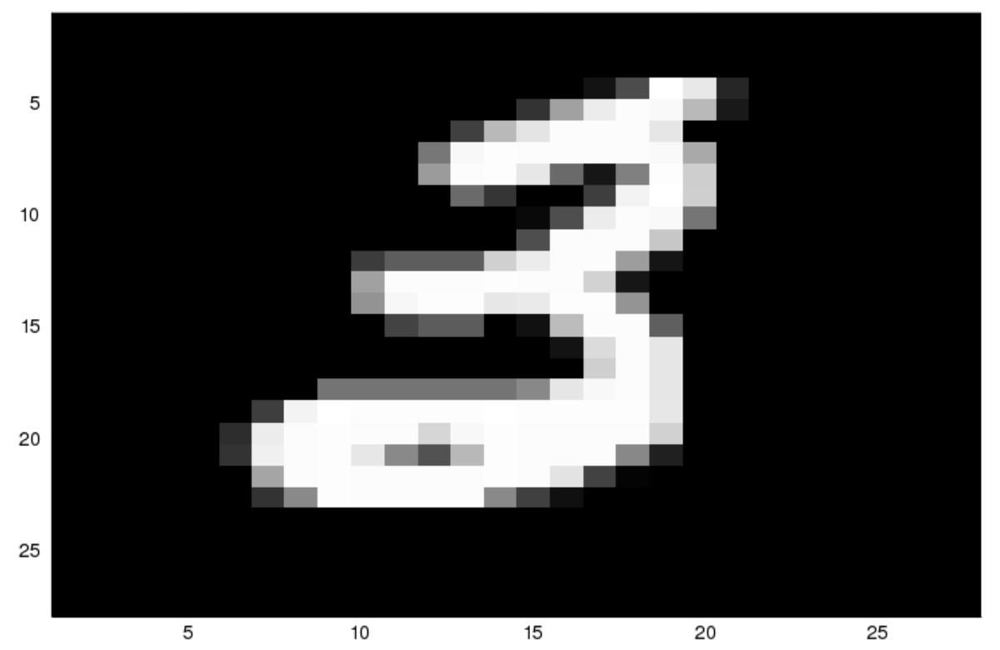
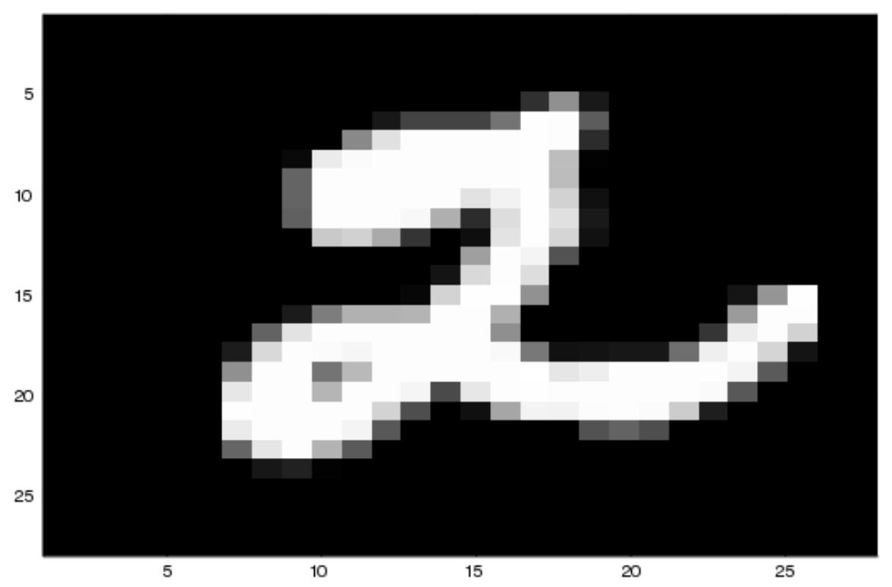

# Neural Network Implementation in Julia
This is implementation of a neural network using Julia for classification of MNIST dataset. It doesn't use any machine learning libraries. Primary purpose for this project is to learn neural networks basics and Julia language. [Julia language](https://julialang.org) is relatively new amongst other preferred language for data science.

## About the dataset
MNIST is dataset of labelled 28 x 28 images of handwritten digits. There is training set with 60,000 images and a testing set of 10,000 images. All images in both the sets are labelled. The primary goal is to classify these images by identifying the digit it represents. More information about the dataset and its source is available [here](http://yann.lecun.com/exdb/mnist/).

## Examples from dataset
Following examples are produced with Plots and Images package available for Julia.

## Acknowledgements
Thanks to [Michael Nielsen](http://michaelnielsen.org) for crafting a wonderful [book on neural networks and deep learning](http://neuralnetworksanddeeplearning.com). It's is great source for someone to start out with neural networks. It covers all the basic of neural nets and more importantly the math that make them work. This book has been following in a great capacity for this project.
